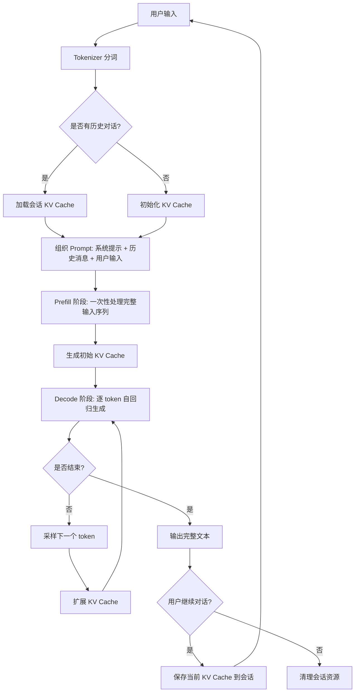
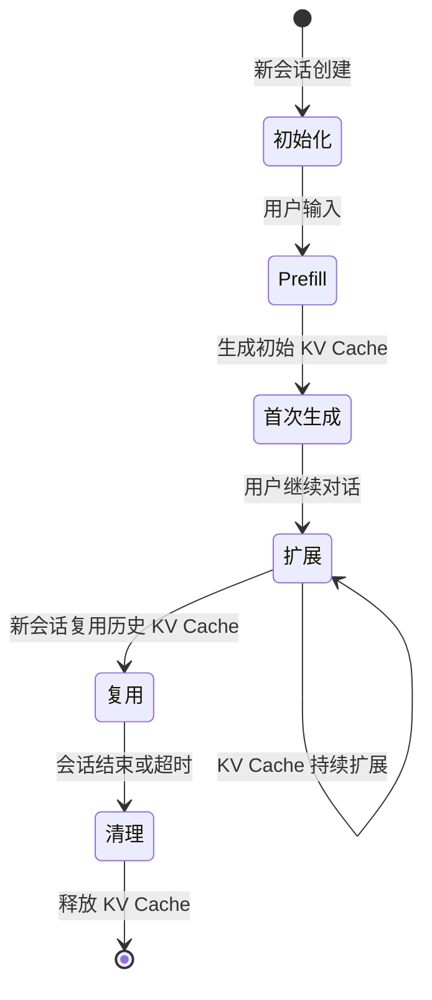

# 生成式 LLM 推理主链路总览

本文介绍生成式大语言模型（LLM）在端侧推理的完整链路，从文本编码到模型输出，涵盖所有关键环节。重点关注端侧环境下的特殊挑战，如首字延迟优化、KV Cache 内存占用、流式输出体验和多会话隔离。

---

## 推理链路全景

生成式 LLM 的推理链路可以分为两个主要阶段：**Prefill（预填充）** 和 **Decode（解码）**。在端侧推理中，这两个阶段的性能优化策略差异很大，需要分别关注。

下图展示了完整的推理流程：



**端侧挑战**：在端侧环境中，Prefill 阶段决定首字延迟（Time to First Token，TTFT），直接影响用户体验；Decode 阶段的每个 token 生成时间影响整体响应速度。同时，KV Cache 的内存占用是端侧推理的核心瓶颈，需要在多轮对话中精细管理。**来源：RESEARCH.md 关键结论 - 大模型端侧推理的特殊挑战**

---

## Tokenizer 与文本编码

### Tokenizer 的作用

Tokenizer 是推理链路的第一道关卡，负责将用户输入的文本转换成模型可理解的 token 序列（整数 ID）。这个过程看似简单，但对端侧推理的性能影响深远。

### 常见分词方法

主流的分词方法包括：

- **BPE（Byte-Pair Encoding）**：通过合并高频字节对构建词表，GPT 系列模型广泛使用
- **WordPiece**：BERT 模型使用，与 BPE 类似但合并策略略有不同
- **SentencePiece**：Google 开发的通用分词工具，支持多种分词算法

分词方法的选择会影响：
- **词汇表大小**：影响模型 embedding 层的内存占用
- **平均 token 数**：同样的文本，不同分词方法产生的 token 数不同，直接影响计算量
- **分词速度**：端侧设备上分词时间会占用整体延迟的一部分

**来源：RESEARCH.md 关键结论 - Tokenizer：文本到 token 的分词过程，影响输入长度和内存占用**

### 端侧 Tokenizer 优化

在端侧环境中，Tokenizer 优化重点关注：

1. **词汇表压缩**：使用更小的词汇表（如 3万 而非 10万）可显著减少 embedding 层内存占用
2. **预处理缓存**：对常用短语进行预分词和缓存，减少实时分词开销
3. **并行分词**：利用多核 CPU 并行处理长文本的分词
4. **增量分词**：对于流式输入，增量式分词可以降低首字延迟

### 编码与特殊 Token

除了常规文本 token，还需要处理特殊 token：

- **BOS（Beginning of Sequence）**：序列开始标记
- **EOS（End of Sequence）**：序列结束标记
- **PAD（Padding）**：填充标记，用于批处理时的长度对齐
- **UNK（Unknown）**：未知词标记

这些特殊 token 在 prompt 组织阶段需要正确插入，否则会影响模型理解。

---

## Prompt 组织与拼接

### Prompt 的结构

一个完整的 Prompt 通常包含以下部分：

```
[系统提示] + [历史对话] + [用户输入] + [可能的特殊标记]
```

#### 系统提示（System Prompt）

系统提示定义模型的角色和行为规则，例如：

```
你是一个友好的 AI 助手，负责帮助用户解决技术问题。请用简洁、准确的语言回答，避免冗余信息。
```

在端侧推理中，系统提示可以：
- **缩短提示长度**：使用更简洁的描述减少 token 数量
- **内置应用提示**：将应用特定的提示预置在模型中，避免每次请求都发送
- **动态调整**：根据场景动态选择不同的系统提示（如"专业模式" vs "简洁模式"）

**来源：RESEARCH.md 关键结论 - Prompt 组织：系统提示、用户输入、历史消息的拼接策略**

#### 历史消息组织

多轮对话需要保留历史消息，但端侧内存有限，必须设计合理的截断策略：

- **窗口截断**：保留最近 N 轮对话（如最近 5 轮）
- **重要性截断**：根据消息的重要性评分，保留更相关的历史
- **上下文压缩**：使用摘要或关键句提取压缩历史内容
- **滑动窗口**：固定长度的上下文窗口，新消息进入时旧消息移出

#### 用户输入处理

用户输入需要经过预处理：
- **文本清洗**：去除无关的空格、换行、特殊字符
- **长度检查**：超过模型最大长度时需要截断或分块
- **敏感信息过滤**：端侧可以在本地过滤敏感信息，避免发送到云端

### 端侧 Prompt 优化挑战

**首字延迟敏感**：Prompt 越长，Prefill 阶段耗时越长。在端侧，用户对首字延迟更敏感，因此需要：
- 预处理常用 prompt 模板
- 避免冗余的系统提示
- 精简历史消息

**内存占用限制**：Prompt 的 token 数直接影响 KV Cache 的初始大小，需要平衡上下文长度和内存占用。

**来源：RESEARCH.md 关键结论 - Prefill 阶段：一次性处理长上下文，生成完整 KV Cache，对首字延迟（TTFT）影响大**

---

## Prefill 与 Decode 阶段

### Prefill 阶段：处理输入序列

Prefill 阶段是模型一次性处理整个输入序列（包括系统提示、历史消息、用户输入）的过程。这个阶段的特点是：

- **计算密集**：需要并行处理所有输入 token
- **一次性生成 KV Cache**：为所有输入 token 生成完整的 Key-Value 缓存
- **决定首字延迟**：Prefill 阶段的耗时直接决定用户看到第一个输出的时间

#### 端侧 Prefill 优化

端侧环境下，Prefill 阶段的优化策略包括：

1. **减少输入长度**：精简系统提示和截断历史消息
2. **批处理优化**：对多个会话的 Prefill 任务进行批处理（如果并发量大）
3. **硬件加速**：使用 NPU 或 GPU 加速 Prefill 计算
4. **预计算缓存**：对常用的系统提示进行预计算并缓存 KV Cache

**来源：RESEARCH.md 关键结论 - Prefill 阶段的特点与作用**

### Decode 阶段：逐 token 生成

Decode 阶段是自回归生成过程，每次生成一个 token，并将其添加到已生成序列中，继续生成下一个 token。这个阶段的特点是：

- **串行计算**：每个 token 的生成依赖前一个 token 的结果，无法并行
- **KV Cache 扩展**：每生成一个 token，需要扩展 KV Cache
- **持续输出**：生成过程可以流式输出给用户，降低感知延迟

#### 端侧 Decode 优化

端侧环境下，Decode 阶段的优化策略包括：

1. **采样策略简化**：使用 greedy sampling 或简化的 top-k 采样，减少计算开销
2. **量化模型**：使用 INT8 或 INT4 量化模型，提高推理速度
3. **算子融合**：将多个算子融合，减少内存访问
4. **投机采样**：用小模型预测，大模型验证，减少大模型推理次数

**来源：RESEARCH.md 关键结论 - Decode 阶段：逐 token 自回归生成，每个 token 的生成时间影响响应速度**

### 性能指标对比

| 阶段 | 计算模式 | 端侧挑战 | 关键指标 | 优化策略 |
|------|---------|---------|---------|---------|
| **Prefill** | 并行计算 | 首字延迟敏感 | TTFT（首字延迟） | 减少输入长度、预计算、硬件加速 |
| **Decode** | 串行计算 | 持续延迟敏感 | Token 生成时间 | 量化、算子融合、投机采样 |

---

## Sampling 策略与参数

### 采样策略概述

Sampling 策略决定了模型如何从概率分布中选择下一个 token，直接影响输出的质量和多样性。

### 常见采样策略

#### 贪婪采样（Greedy Sampling）

选择概率最高的 token 作为输出。

- **优点**：生成速度快，输出确定性强
- **缺点**：可能陷入重复循环，输出缺乏多样性
- **端侧适用性**：适合对延迟敏感的应用，如实时翻译

#### 温度采样（Temperature Sampling）

通过调整温度参数控制输出的随机性。

- **温度 = 0**：等价于贪婪采样
- **温度 > 1**：增加随机性，输出更多样
- **温度 < 1**：减少随机性，输出更确定

```python
# 示例：调整后的概率分布
adjusted_probs = logits ** (1 / temperature) / sum(logits ** (1 / temperature))
```

- **端侧适用性**：适合创意写作、对话生成等需要多样性的场景

#### Top-k 采样

从概率最高的 k 个 token 中随机选择。

- **k 值选择**：通常选择 40-50
- **优点**：避免低概率 token 的干扰，输出质量更稳定
- **缺点**：k 值过小会降低多样性
- **端侧适用性**：平衡质量和多样性的通用策略

#### Top-p（Nucleus）采样

从累积概率达到 p 的最小 token 集合中随机选择。

- **p 值选择**：通常选择 0.9-0.95
- **优点**：动态调整候选集，适应不同模型输出
- **缺点**：计算略复杂于 top-k
- **端侧适用性**：适合需要自适应调整的场景

**来源：RESEARCH.md 关键结论 - Sampling 策略：贪婪采样、温度、top-k、top-p 等策略影响输出质量和多样性**

### 端侧采样优化

端侧环境下，采样策略的优化重点：

1. **简化采样**：使用 greedy 或简单的 top-k 采样，减少计算开销
2. **预计算阈值**：预计算 top-k 或 top-p 的阈值，避免实时排序
3. **缓存概率分布**：对常用 prompt 的概率分布进行缓存
4. **动态调整**：根据设备性能动态调整采样策略（如高负载时用 greedy）

### 采样参数对输出质量的影响

| 参数 | 推荐值（端侧） | 对输出的影响 | 端侧优化建议 |
|------|--------------|-------------|-------------|
| **Temperature** | 0.7-0.9 | 温度越高，输出越随机 | 动态调整，高性能设备用较高温度 |
| **Top-k** | 40-50 | k 值越大，输出越多样 | 低端设备用较小的 k 值 |
| **Top-p** | 0.9-0.95 | p 值越小，输出越保守 | 预计算阈值，避免实时排序 |

---

## Streaming 输出与延迟优化

### Streaming 输出的优势

Streaming 输出是指模型在生成过程中逐 token 或逐片段地输出结果，而不是等待完整生成后再输出。这种方式的优点：

- **降低感知延迟**：用户可以边生成边阅读，减少等待感
- **提升交互体验**：实时看到输出，感觉更流畅
- **支持中断**：用户可以在生成过程中中断，节省计算资源

**来源：RESEARCH.md 关键结论 - Streaming 输出：流式推理可以降低用户感知延迟，但需要合理的分块策略**

### 端侧 Streaming 实现

#### 分块策略

Streaming 输出需要确定合理的分块策略：

- **按 token 分块**：每生成一个 token 就输出，实时性最强但网络开销大
- **按片段分块**：每生成 N 个 token 或达到一定字数后输出，平衡实时性和开销
- **按句子分块**：每生成完整句子后输出，保证输出可读性

#### 延迟优化

端侧环境下，Streaming 输出的延迟优化包括：

1. **减少首字延迟**：优化 Prefill 阶段，让用户尽快看到第一个输出
2. **降低生成延迟**：优化 Decode 阶段，提高每个 token 的生成速度
3. **平滑输出**：使用缓冲策略避免输出卡顿
4. **预加载资源**：提前加载模型和依赖，避免启动延迟

#### 用户体验优化

Streaming 输出的用户体验优化：

- **视觉反馈**：显示生成进度或打字效果
- **中断支持**：允许用户中断生成
- **重试机制**：生成失败时自动重试
- **错误处理**：优雅处理生成错误，避免影响整体体验

### 端侧 vs 云侧 Streaming 对比

| 特性 | 端侧 Streaming | 云侧 Streaming |
|------|---------------|---------------|
| **首字延迟** | 受限于设备性能，通常较高 | 网络延迟较低，但可能有排队延迟 |
| **生成速度** | 受限于设备性能，通常较慢 | 云端算力充足，通常较快 |
| **网络依赖** | 无网络依赖 | 依赖网络质量 |
| **隐私保护** | 数据不出设备 | 数据需要上传到云端 |

---

## Session State 与多轮对话

### 会话状态的定义

会话状态（Session State）是指在一次多轮对话中需要保存的所有信息，包括：

- **历史消息**：用户和模型的历史对话内容
- **KV Cache**：已生成 token 的 Key-Value 缓存
- **系统提示**：本轮对话使用的系统提示
- **上下文信息**：如用户 ID、对话时间等

**来源：RESEARCH.md 关键结论 - Session State：多轮对话的会话管理，需要高效存储和检索历史 KV Cache**

### 多轮对话的 KV Cache 复用

在多轮对话中，复用 KV Cache 可以显著提升性能：

- **避免重复计算**：历史消息的 KV Cache 可以直接复用，无需重新 Prefill
- **降低首字延迟**：新对话的首字延迟大幅降低
- **减少内存开销**：不需要为每轮对话重新分配 KV Cache

#### KV Cache 复用的实现

```python
# 伪代码：KV Cache 复用
def generate_with_cache(session_id, new_input):
    # 从会话中加载历史 KV Cache
    kv_cache = session_manager.get_kv_cache(session_id)

    # 只对新输入进行 Prefill
    new_tokens = tokenizer.encode(new_input)
    new_kv_cache = prefill(new_tokens, kv_cache)

    # Decode 阶段复用整个 KV Cache
    output_tokens = decode(new_kv_cache)

    # 更新会话的 KV Cache
    session_manager.update_kv_cache(session_id, new_kv_cache)

    return tokenizer.decode(output_tokens)
```

### 会话的生命周期

端侧环境下，会话的生命周期管理需要考虑：

#### 会话创建

- **新会话**：用户开始新的对话时，初始化新的会话状态
- **会话复用**：用户继续之前的对话时，从存储中恢复会话状态

#### 会话更新

- **KV Cache 扩展**：每轮对话后，扩展 KV Cache
- **历史消息追加**：将本轮对话追加到历史消息
- **上下文管理**：根据策略截断历史消息，控制上下文长度

#### 会话清理

- **会话结束**：用户明确结束对话时，清理会话资源
- **会话超时**：会话长时间无活动时，自动清理
- **内存压力**：内存不足时，清理低优先级会话

**来源：RESEARCH.md 关键结论 - KV Cache 生命周期：创建、扩展、复用、清理**

### 端侧会话隔离

端侧环境下，多个会话需要隔离管理：

- **独立 KV Cache**：每个会话维护独立的 KV Cache
- **内存隔离**：会话之间共享内存池，但不会互相干扰
- **并发控制**：控制并发会话数量，避免内存溢出
- **会话优先级**：根据应用场景设置会话优先级，内存不足时优先清理低优先级会话

---

## KV Cache 生命周期管理

### KV Cache 的作用

KV Cache（Key-Value Cache）是 Transformer 模型的关键优化，用于存储自注意力机制中的 Key 和 Value 矩阵。在生成式推理中，KV Cache 可以避免重复计算历史 token 的注意力，大幅提升性能。

**来源：RESEARCH.md 关键结论 - KV Cache 生命周期：新会话创建、每轮对话扩展、会话清理、内存回收**

### KV Cache 的内存占用分析

KV Cache 的内存占用是端侧推理的核心挑战。对于一个包含 L 层、隐藏维度为 H、注意力头数为 A 的模型，每个 token 的 KV Cache 占用为：

```
KV Cache 内存占用（每 token） = 2 × L × H × A × sizeof(dtype)
```

其中：
- `2` 表示 Key 和 Value 两个矩阵
- `L` 是层数
- `H` 是隐藏维度
- `A` 是注意力头数
- `sizeof(dtype)` 是数据类型大小（FP16 为 2 字节，INT8 为 1 字节）

**示例**：对于一个 32 层、隐藏维度 4096、32 个注意力头的模型，使用 FP16 类型时，每个 token 的 KV Cache 占用约为 8 MB。

如果上下文长度为 2048 tokens，总 KV Cache 占用约为 16 GB，这在端侧设备上难以承受。

**来源：RESEARCH.md 关键结论 - KV Cache 的内存占用分析**

### KV Cache 优化策略

端侧环境下，KV Cache 的优化策略包括：

#### 1. 量化 KV Cache

将 KV Cache 从 FP16 量化到 INT8，可减少 50% 的内存占用：

- **优点**：内存占用大幅降低，精度损失较小
- **缺点**：量化计算可能略微增加延迟
- **适用性**：适合内存敏感的场景

#### 2. KV Cache 压缩

使用压缩算法减少 KV Cache 的内存占用：

- **稀疏化**：保留最重要的 KV pairs，丢弃低重要性的
- **低秩分解**：将 KV Cache 分解为低秩矩阵
- **共享 Key/Value**：在多头注意力中共享部分 Key/Value

**来源：RESEARCH.md 关键结论 - KV Cache 优化策略**

#### 3. 滑动窗口

限制 KV Cache 只保留最近的 N 个 tokens：

- **优点**：内存占用可控，适合长对话
- **缺点**：丢失早期上下文，可能影响理解
- **适用性**：适合对话类应用，早期内容对当前轮次影响较小

#### 4. 分层 KV Cache

将模型分层，不同层使用不同长度的 KV Cache：

- **浅层**：使用较短的 KV Cache（如最近 512 tokens）
- **深层**：使用较长的 KV Cache（如最近 2048 tokens）

这种策略可以在保持模型性能的同时降低内存占用。

#### 5. KV Cache Offloading

将部分 KV Cache 卸载到磁盘或云端：

- **优点**：大幅降低内存占用
- **缺点**：访问速度变慢，影响推理性能
- **适用性**：适合内存极度受限的场景，如移动设备

### 多会话的 KV Cache 管理

端侧环境下，多个会话的 KV Cache 管理策略：

1. **内存池管理**：预先分配固定大小的内存池，所有会话共享
2. **LRU 缓存**：使用最近最少使用策略管理 KV Cache，内存不足时自动清理
3. **会话优先级**：根据应用场景设置会话优先级，优先清理低优先级会话的 KV Cache
4. **动态调整**：根据设备内存压力动态调整 KV Cache 大小

### KV Cache 的生命周期

下图展示了 KV Cache 在多轮对话中的完整生命周期：



**来源：RESEARCH.md 关键结论 - KV Cache 生命周期：创建、扩展、复用、清理**

---

## 端侧推理特殊挑战总结

生成式 LLM 在端侧推理面临的特殊挑战主要集中在以下几个方面：

### 1. 首字延迟（TTFT）

- **挑战**：Prefill 阶段耗时直接影响用户看到第一个输出的时间
- **优化**：减少输入长度、预计算、硬件加速
- **目标**：首字延迟控制在 500ms 以内（移动设备）

### 2. KV Cache 内存占用

- **挑战**：KV Cache 占用大量内存，端侧设备内存有限
- **优化**：量化、压缩、滑动窗口、分层 KV Cache、Offloading
- **目标**：在 4GB-8GB 内存的设备上支持 2K-4K 上下文长度

### 3. 流式输出体验

- **挑战**：Streaming 输出需要平滑流畅，避免卡顿
- **优化**：合理的分块策略、缓冲机制、预加载资源
- **目标**：输出流畅，无明显停顿

### 4. 会话隔离与管理

- **挑战**：多会话需要隔离管理，内存不足时需智能清理
- **优化**：内存池管理、LRU 缓存、会话优先级、动态调整
- **目标**：支持 3-5 个并发会话，会话切换时间 < 100ms

**来源：RESEARCH.md 关键结论 - 大模型端侧推理的特殊挑战**

---

## 小结

生成式 LLM 的推理链路是一个复杂的系统工程，涉及文本编码、Prompt 组织、Prefill/Decode、Sampling、Streaming、会话管理等多个环节。在端侧环境下，这些环节都面临独特的挑战：

- **Tokenizer**：影响输入长度和内存占用，需要优化词汇表和分词算法
- **Prompt 组织**：需要在上下文长度和内存占用之间取得平衡
- **Prefill 与 Decode**：两个阶段的优化策略不同，需要分别关注
- **Sampling**：需要在输出质量和多样性之间权衡
- **Streaming**：需要合理的分块策略，降低用户感知延迟
- **Session State**：需要高效存储和检索历史 KV Cache
- **KV Cache**：是端侧推理的核心瓶颈，需要精细的生命周期管理

下一章将详细介绍端侧硬件加速器，包括 NPU、GPU、CPU 的能力与特性，以及异构计算调度策略。
